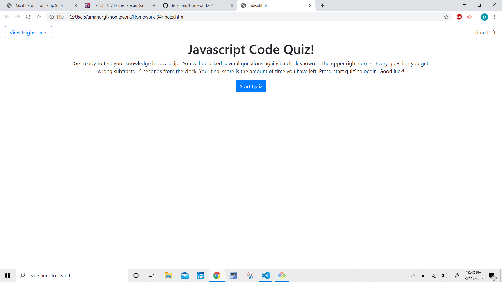
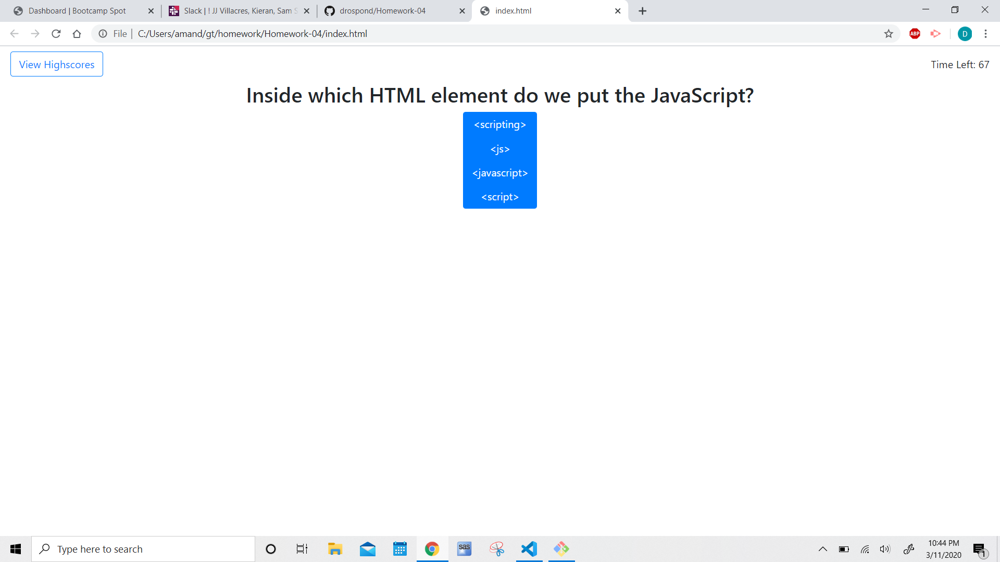
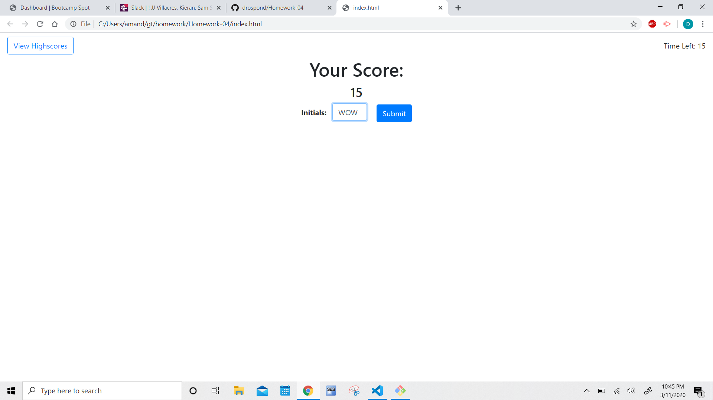
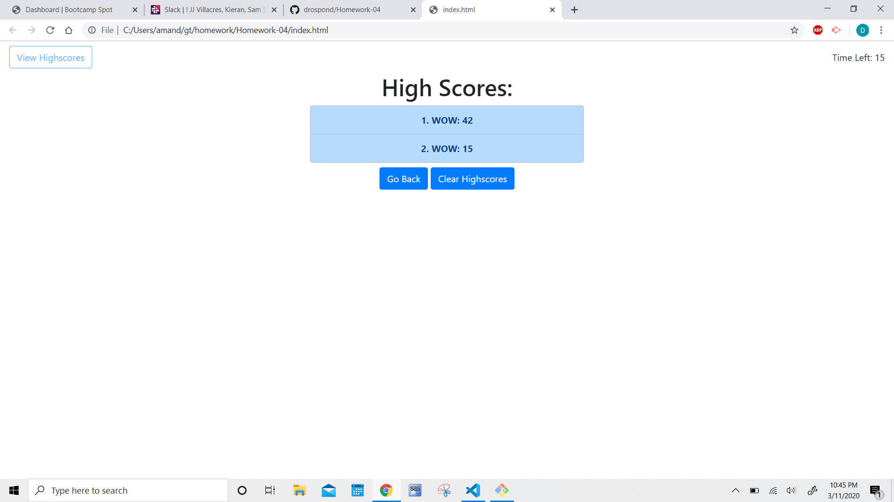

# Homework-04 Javascript Code Quiz

## Description
Javascript code quiz is quiz game that tests your coding knoweledge. The more questions you get wrong the less time you have to finish. Your final score, the time remaining, can be saved on a highscore list. The webpage was built using knoweledge of javascript and the native web APIs for dynamically changing the DOM.

## Screenshots

## Resources
Bootstrap was largely used for the styling. A shuffling function was sourced from  https://javascript.info/task/shuffle.

## Link
Deployed application: https://drospond.github.io/JavaScript-Code-Quiz/
